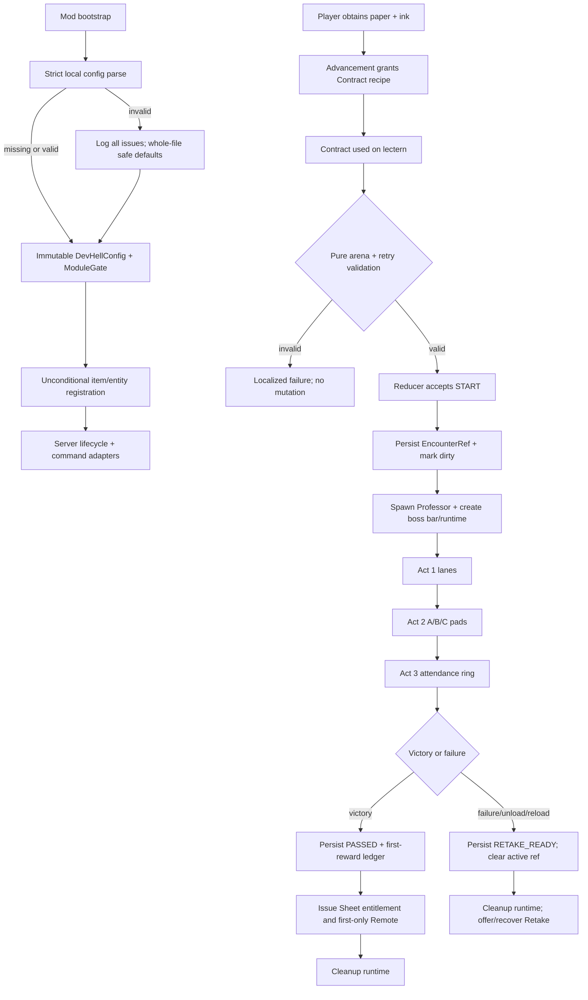

# Phase 2: Persistent Lecture Vertical Slice - Research

**Researched:** 2026-08-26
**Domain:** Fabric 26.2 server-authoritative campaign state, custom entity encounter, local configuration, and GameTests
**Confidence:** HIGH for the local build/API surface; MEDIUM for gameplay tuning

<user_constraints>
## User Constraints (from CONTEXT.md)

<!-- source-boundary: context-02-7c3f2a9e BEGIN -->

### Locked Decisions

### Safe Startup Configuration and Module Gates
- Load one immutable, versioned local configuration at startup without adding a runtime library. Preserve all eight stable `ModuleId` keys and construct the existing immutable `ModuleGate`; registration remains unconditional and toggles control behavior only.
- Campaign play is enabled by default. Metadata Roulette and Three-Day Deadline scheduling remain manual/off, boss block damage remains false, difficulty defaults to Standard, reduced flashing defaults on, and all caps/timers are bounded.
- Validate the complete file before applying it. Report every invalid path, rejected value, and allowed range; fail closed to public-safe defaults rather than partially enabling risky behavior. Do not overwrite an invalid user file.
- Keep all gameplay offline and server-authoritative. Configuration contains no API key, network endpoint, personal/employer identity, or claim about real spending.

### Contract Discovery, Internship Desk, and Arena
- Unlock the Contract recipe through a small local advancement when the player obtains obvious ingredients such as paper and ink. Localized tooltip text explains that it starts Lecture 1 and must be used on a lectern facing clear Overworld ground; commands are recovery/testing tools, not the normal discovery path.
- A lectern is the Internship Desk. Its clicked position and facing establish the player-selected arena origin and local forward/right axes. Validate an approximately 17x17 boundary with a 15x15 combat interior, solid floor, four blocks of headroom, loaded chunks, world-border safety, and the exact Overworld dimension.
- Invalid placement produces a specific localized reason, consumes no Contract, writes no campaign state, and spawns nothing. The fight never edits or destroys blocks by default and does not use block-damaging explosions.
- Find and persist a bounded nearby safe retry position in campaign state without replacing the player's bed or vanilla respawn point. Retake Form interaction at the same Internship Desk safely starts a later attempt when no encounter is active.

### Professor Infinite Slides Fight and Readability
- Use a stable custom boss entity with the simplest compile-proven vanilla renderer/silhouette; no new bitmap, model, OGG, shader, custom HUD, or screen is required in this phase. The entity, attacks, damage, particles, sounds, boss bar, and messages are owned by common/server code; client code is renderer registration only if needed.
- Present the fight through a `ServerBossEvent`, action-bar instructions/countdowns, low-frequency system chat, bounded server particles, and distinct vanilla sounds/subtitles. Every harmful pattern must communicate attack name, text instruction, geometric outline, non-color-only symbol/direction, wind-up, and recovery/damage window.
- Act 1, Slide Deck: split the 15x15 interior into LEFT/CENTER/RIGHT five-block lanes, deterministically choose one safe lane, telegraph for about five seconds with safe outline plus danger X shapes, then resolve server-side position and open a short Projector Cooldown damage window.
- Act 2, Surprise Quiz: show one localized joke prompt and three fixed A/B/C pads using square/circle/diamond identities. Select the correct pad deterministically from encounter seed and quiz index, allow about eight seconds, and make wrong/no answers bounded rather than lethal.
- Act 3, Attendance Check: choose one deterministic quadrant circle, announce FRONT/BACK plus LEFT/RIGHT, ring a bell, allow about six seconds, and track ABSENT 1/3 through 3/3. The third miss may cause bounded detention damage but never an instant kill; success opens the final damage window.
- Reduced-effects mode removes ambient density but retains essential corners/segments, boss/action text, shape identity, and sound. Never use forced camera shake, nausea, full-screen flashes, rapid glow toggling, or strobing.

### Persistence, Cleanup, Retry, and Exactly-Once Rewards
- Store versioned, monotonic per-player campaign progress in logical-server world saved data. Keep chapter state separate from an optional active `EncounterRef`; at most one active encounter exists per player and callbacks must match owner plus encounter UUID.
- Persist the transition before applying world/reward effects. Duplicate, stale, wrong-owner, repeated-death, unload, and rejoin callbacks become idempotent no-ops and cannot regress chapter, attempt count, milestones, entitlements, or issued rewards.
- On save/reload or chunk unload, prefer deterministic cleanup to resuming an in-flight cast: clear the active attempt, discard or reject orphan encounter-owned entities when they load, remove boss bars/hazards, cancel telegraphs, preserve chapter/checkpoint/attempt count/reward ledger, and offer a safe Retake Form.
- Death, escape, timeout, dimension change, disconnect, abort, or server stop first records the failed attempt and clears the active reference, then removes bars and bounded encounter-owned objects. Cleanup-triggered unload events cannot apply a second failure.
- Attendance Sheet is a durable recoverable entitlement once Lecture is passed. Infinite Slides Remote is a practical reward issued only on the first matching victory, never through ordinary entity loot, and has a visible 20-second cooldown. Losing the Sheet allows recovery without duplicating the Remote or progression.
- Automated acceptance must cover immutable config/defaults/errors, reducer transitions and mismatched events, codec round trips/schema handling, deterministic geometry/timers/damage bounds, all failure reasons, reload-to-retake cleanup, orphan rejection, exactly-once victory/rewards, Contract arena lifecycle, block preservation, and Remote cooldown through unit tests plus real Fabric GameTests.

### the agent's Discretion

- Choose the exact vanilla boss renderer/entity superclass and placeholder item model references after compile-checking the Minecraft 26.2 signatures; prefer the smallest side-safe implementation.
- Tune bounded damage, health, particle density, recovery duration, arena search radius, and joke wording while preserving the decisions and readability constraints above.

### Deferred Ideas (OUT OF SCOPE)

- Bespoke professor model/texture, generated art, custom sounds, custom HUD, screen-edge overload overlay, and other cosmetic polish belong in the release/showcase phase unless spare time remains after the complete campaign.
- Hostile Jury, Chairman, Rich ChatGPT/Codex Overdraft, Diploma, objective journal, showcase, and boss replay belong in Phase 3.
- Python tools, fake terminal agents, Git revert, Stack Overflow Totem, Rubber Duck, Deadline mode, and Metadata Roulette remain in Phases 4–5.

<!-- source-boundary: context-02-7c3f2a9e END -->

The block above is copied verbatim from the decisions and deferred sections of `02-CONTEXT.md`. [VERIFIED: `.planning/phases/02-persistent-lecture-vertical-slice/02-CONTEXT.md:17-47,88-92`]
</user_constraints>

<phase_requirements>
## Phase Requirements

| ID | Description | Research Support |
|----|-------------|------------------|
| FND-05 | “The mod validates configuration at startup, reports actionable errors, and defaults destructive or scheduled chaos to opt-in behavior.” | Strict whole-file config pipeline, immutable records, public-safe default matrix, and unit-test matrix below. [VERIFIED: `.planning/REQUIREMENTS.md:14`]
| FND-06 | “Versioned campaign, encounter, reward, and module state survives save, quit, reload, death, and chunk unload without duplication or regression.” | `SavedDataType` + `Codec`, monotonic reducer, encounter UUID matching, commit-before-effect ledger, orphan rejection, and lifecycle cleanup below. [VERIFIED: `.planning/REQUIREMENTS.md:15`]
| FND-07 | “Automated unit tests and Fabric GameTests cover state transitions, bounds, persistence, and at least one real encounter lifecycle before release.” | Existing Loader JUnit/GameTest infrastructure plus the requirement-to-test map and Wave 0 gaps below. [VERIFIED: `.planning/REQUIREMENTS.md:16`]
| CAMP-01 | “A new player can discover, craft, and use the Cursed Unpaid Internship Contract without consulting an external wiki or using an admin command.” | Advancement-unlocked recipe, tooltip, lectern interaction, localization, and recovery-only command design below. [VERIFIED: `.planning/REQUIREMENTS.md:20`]
| CAMP-02 | “Starting the Contract validates a player-selected overworld arena, creates a nearby retry checkpoint, and leaves blocks undamaged by default.” | Pure geometry validator, atomic start transaction, bounded retry search, and before/after block snapshots below. [VERIFIED: `.planning/REQUIREMENTS.md:21`]
| LECT-01 | “The player can defeat Professor Infinite Slides by learning three readable acts: Slide Deck safe lanes, deterministic Surprise Quiz pads, and Attendance Check positioning.” | Deterministic act state machine and redundant telegraph contract below. [VERIFIED: `.planning/REQUIREMENTS.md:29`]
| LECT-02 | “Defeating Professor Infinite Slides grants the Attendance Sheet and a cooldown-limited Infinite Slides Remote after a fight that supports failure, cleanup, retry, and mid-campaign persistence.” | Exactly-once reward ledger, recoverable Sheet entitlement, persisted Remote deadline, and failure normalization below. [VERIFIED: `.planning/REQUIREMENTS.md:30`]
</phase_requirements>

## Summary

Phase 2 should be implemented as one server-authoritative vertical slice with three deliberately separate layers: immutable startup configuration, a pure monotonic campaign reducer backed by Overworld `SavedData`, and an ephemeral lecture runtime that owns the entity, boss bar, particles, timers, and cleanup. Persist chapter/checkpoint/entitlements/reward ledger and an optional encounter reference; do not persist an in-flight cast. On load or unload, normalize an active attempt to `RETAKE_READY` and reject orphan encounter-owned entities. [VERIFIED: `02-CONTEXT.md:17-43`; Minecraft 26.2 `SavedDataType`, `SavedDataStorage`, `ValueInput`, and `ValueOutput` signatures inspected from the cached common JAR]

The compile-small boss choice is a custom `ProfessorEntity extends Vindicator`, registered with Vindicator attributes and rendered on the client with the vanilla `VindicatorRenderer`. The current 26.2 packages and constructors were inspected directly; older tutorials use names and registration helpers that no longer match. All authoritative encounter behavior stays in common/server code, while `DevelopersHellClient` performs only renderer registration. [VERIFIED: cached Minecraft 26.2 common/client JAR `javap`; cached Fabric API entity source JAR; `src/client/java/dev/developershell/client/DevelopersHellClient.java:5-9`]

No dependency or bespoke asset is needed. The current Gradle/Fabric tuple, Loader JUnit source set, GameTest source set, vanilla paper/map/repeater item rendering, vanilla sounds/particles, and Minecraft-provided Gson are enough. The plan should create test seams before the encounter: strict config parser, codec/reducer, geometry/timing helpers, then one real Contract-to-victory GameTest and focused failure/idempotence GameTests. [VERIFIED: `gradle.properties:10-20`; `build.gradle:21-58`; `02-CONTEXT.md:29-43`]

**Primary recommendation:** Build config + pure campaign domain first, wire atomic Contract/Retake/reward transactions second, then add the vanilla-rendered Professor runtime and GameTests; never make world effects the source of truth. [VERIFIED: synthesis of locked persistence decisions and inspected 26.2 persistence/event APIs]

## Architectural Responsibility Map

| Capability | Primary Tier | Secondary Tier | Rationale |
|------------|--------------|----------------|-----------|
| Config parsing and module gates | Common bootstrap | Logical server | Parse once into immutable values before behavior hooks; registry identities stay unconditional. [VERIFIED: `02-CONTEXT.md:17-21`; `ModItems.java:10-24`]
| Campaign/checkpoint/reward state | Logical server | World storage | Overworld `SavedDataStorage` owns durable per-player data; clients never mutate progression. [VERIFIED: Minecraft 26.2 `ServerLevel.getDataStorage()` and `SavedDataStorage.computeIfAbsent(...)`]
| Contract/Retake/Remote interactions | Logical server | Common item classes | Client use is a request; validation, inventory mutation, cooldown, spawn, and state commit occur on the server. [VERIFIED: Minecraft 26.2 `Item.use`, `Item.useOn`, `Player.getCooldowns()` signatures]
| Lecture encounter controller | Logical server | Custom entity | Controller owns state machine and effects; entity is a stable identity/combat target carrying owner and encounter UUID. [VERIFIED: `02-CONTEXT.md:29-42`]
| Boss presentation | Logical server | Client renderer | `ServerBossEvent`, chat, action bar, particles, and vanilla sounds are driven from server state; the client only renders the registered entity. [VERIFIED: Minecraft 26.2 `ServerBossEvent` and `ServerLevel.sendParticles(...)`; `02-CONTEXT.md:29-35`]
| Item/entity registration | Common registry | Client registry | Stable IDs/types register regardless of gates; only renderer binding is client-only. [VERIFIED: `ModItems.java:13-24`; `AGENTS.md:230`]
| Pure tests | JVM test source set | — | Config, reducer, codecs, geometry, timers, and cooldown arithmetic do not need a transformed world. [VERIFIED: `build.gradle:50-58`]
| Lifecycle tests | Fabric GameTest server | — | Spawning, interactions, boss cleanup, block preservation, and rewards require the real transformed game runtime. [CITED: https://docs.fabricmc.net/develop/automatic-testing]

## Project Constraints (from AGENTS.md)

- Target exactly Minecraft Java `26.2`, Fabric, and JDK 25; do not drift to 26.3 snapshots. [VERIFIED: quote “Game target: Minecraft Java 26.2” and “Runtime: JDK 25” in `AGENTS.md:16-18`]
- Deliver one offline-first JAR, singleplayer-first, with reproducible GitHub-ready source; no remote service/account/subscription is allowed. [VERIFIED: quotes “Packaging: One JAR”, “Operation: Offline-first”, “Scope: Singleplayer-first”, and “Distribution: GitHub-ready source” in `AGENTS.md:19-22`]
- Defaults must remain fictional/public-safe and assets must be original or license-compatible. [VERIFIED: quotes “Privacy: Fictional/public-safe defaults” and “Assets: Original or license-compatible assets only” in `AGENTS.md:23-24`]
- Use only `gradlew.bat`; do not add Yarn/remap Loom, raw OpenGL, common-side client imports, OpenAI/HTTP/telemetry, GeckoLib/Architectury/Kotlin/Cloth/Mod Menu/mixin helpers, a database/service, nightlies, unclear assets, or unseeded test randomness. [VERIFIED: `AGENTS.md:224-236`]
- The existing GSD workflow is active and this file is planning research only; implementation belongs to the phase executor. [VERIFIED: `AGENTS.md` GSD Workflow Enforcement section]

## Standard Stack

### Core

| Library/API | Version | Purpose | Why Standard Here |
|-------------|---------|---------|-------------------|
| Minecraft Java | `26.2` | Runtime, registries, saved data, entity AI, boss bars | Exact project target; sources/artifacts are already cached. [VERIFIED: quote `minecraft_version=26.2` in `gradle.properties:10`]
| Java | release `25` | Records, sealed/pure domain types, compilation/runtime | Build enforces release/source/target 25. [VERIFIED: `build.gradle:70-85`]
| Fabric Loader | `0.19.3` | Entrypoints and Loader JUnit | Exact pinned dependency. [VERIFIED: quote `loader_version=0.19.3` in `gradle.properties:11`]
| Fabric API | `0.158.0+26.2` | Lifecycle, entity attributes, interaction callbacks, GameTests | Already pinned umbrella dependency; no module curation needed. [VERIFIED: quote `fabric_api_version=0.158.0+26.2` in `gradle.properties:20`; `build.gradle:47-54`]
| Fabric Loom | `1.17.19` | Split sources, transformed runs, GameTests | Existing compile-proven build plugin. [VERIFIED: quote `loom_version=1.17.19` in `gradle.properties:12`; `build.gradle:1-3`]
| Gradle Wrapper | `9.5.1` | Reproducible offline build/test | Project wrapper is authoritative; do not use global Gradle. [VERIFIED: `gradle/wrapper/gradle-wrapper.properties` distribution URL; `AGENTS.md:228`]

### Supporting (already available; add no dependencies)

| Surface | Purpose | Prescriptive use |
|---------|---------|------------------|
| Vanilla `SavedData`/`Codec` | Durable campaign data | One versioned Overworld save object; `setDirty()` after every accepted transition. [VERIFIED: cached Minecraft 26.2 common JAR]
| Fabric lifecycle/entity/player events | Cleanup and normalization | Bind server stop, player death/leave/respawn/join, and entity load/unload once at bootstrap. [VERIFIED: cached Fabric API lifecycle/entity source JARs]
| Vanilla `ServerBossEvent` | Boss name/progress | Create per encounter; add only the owner; always hide/remove all during cleanup. [VERIFIED: cached Minecraft 26.2 common JAR]
| Vanilla `Vindicator` + renderer | Compile-small Professor placeholder | Subclass common Vindicator; use Vindicator attributes and client renderer; omit bespoke art. [VERIFIED: cached Minecraft 26.2 common/client JAR]
| Minecraft-provided Gson `2.14.0` | Local config syntax parsing | Use strict `JsonReader` plus explicit schema validation; do not declare a direct dependency. [VERIFIED: `gradlew.bat dependencies` resolved compile classpath in this research session]
| Loader JUnit + Fabric GameTest | Pure and in-runtime acceptance | Unit tests for deterministic domain; server GameTests for world interactions. [VERIFIED: `build.gradle:32-58`; `FoundationGameTests.java:12-24`]

### Package Legitimacy Audit

Not applicable: Phase 2 installs no external package and must preserve the current direct-dependency allowlist. [VERIFIED: `02-CONTEXT.md:61-66`; `build.gradle:105-243`]

## Architecture Patterns

### System Architecture Diagram



The crucial ordering in both branches is reducer acceptance → saved-state mutation/`setDirty()` → world/inventory effects → bounded cleanup. [VERIFIED: `02-CONTEXT.md:37-43`; Minecraft 26.2 `SavedData.setDirty()`]

### Recommended Project Structure

```text
src/main/java/dev/developershell/
├── DevelopersHell.java                    # bootstrap only
├── config/
│   ├── DevHellConfig.java                 # immutable validated records
│   ├── ConfigIssue.java                   # path/value/expected metadata
│   └── ConfigLoader.java                  # strict JSON + whole-file fallback
├── campaign/
│   ├── CampaignSavedData.java             # versioned Codec + SavedDataType
│   ├── PlayerCampaignState.java            # monotonic durable state
│   ├── CampaignEvent.java                  # closed reducer inputs
│   ├── CampaignTransition.java             # next state + effect intents
│   ├── CampaignReducer.java                # pure, idempotent transition rules
│   └── CampaignService.java                # commit-before-effect boundary
├── lecture/
│   ├── LectureGeometry.java                # arena coordinates and validation
│   ├── LectureTimeline.java                # deterministic act timings
│   ├── LectureRuntime.java                 # ephemeral encounter-owned objects
│   ├── LectureEncounterManager.java        # server tick/lifecycle owner
│   └── ProfessorEntity.java                # Vindicator-derived combat identity
├── item/
│   ├── ContractItem.java
│   ├── RetakeFormItem.java
│   └── InfiniteSlidesRemoteItem.java
├── registry/
│   ├── ModItemIds.java / ModItems.java
│   └── ModEntityIds.java / ModEntities.java
├── server/DevHellCommands.java
└── text/DevHellText.java                   # translation keys only

src/client/java/dev/developershell/client/
└── DevelopersHellClient.java              # vanilla renderer registration only

src/test/java/dev/developershell/
├── config/DevHellConfigTest.java
├── campaign/CampaignReducerTest.java
├── campaign/CampaignCodecTest.java
└── lecture/{LectureGeometry,LectureTiming,RemoteCooldown}Test.java

src/gametest/java/dev/developershell/gametest/
├── FoundationGameTests.java
├── LectureGameTests.java
└── LectureTestArena.java                   # padded fixture + teardown/snapshots
```

This structure preserves the already configured common/client split and the separate pure-test/GameTest source sets. [VERIFIED: quote `splitEnvironmentSourceSets()` and `createSourceSet = true` in `build.gradle:21-39`]

### Pattern 1: Strict Whole-File Configuration

Use a two-stage loader: syntax/shape collection into a candidate, then semantic validation into immutable records. Never mutate global config while parsing. If any issue exists, log every collected issue and install one complete public-safe default object; leave the invalid file byte-for-byte unchanged. [VERIFIED: `02-CONTEXT.md:17-21`]

Prescriptive config contract:

| Concern | Exact planning decision |
|---------|-------------------------|
| Location | Resolve only `FabricLoader.getInstance().getConfigDir().resolve("developers-hell.json")`; never accept a path from the config itself. [VERIFIED: offline/local-config boundary in `02-CONTEXT.md:17-21`]
| File guard | Reject a symbolic link and a file larger than 64 KiB; this is the recommended bounded cap under the agent's discretion. [VERIFIED: bounded-cap requirement and agent discretion in `02-CONTEXT.md:19,45-47`]
| JSON mode | Create `JsonReader`, call `setStrictness(Strictness.STRICT)`, stream objects while tracking seen property names, and reject duplicate/unknown keys. [VERIFIED: Gson 2.14.0 cached JAR exposes `JsonReader.setStrictness(Strictness)` and enum values `LENIENT`, `LEGACY_STRICT`, `STRICT`; duplicate tracking is a prescribed implementation pattern]
| Validation | Collect `ConfigIssue(path, rejectedValue, expected)` for all semantically reachable fields; validate before constructing `DevHellConfig`. [VERIFIED: `02-CONTEXT.md:20`]
| Missing file | Apply defaults in memory and attempt to create a human-readable default template; failure to write is non-fatal because the in-memory defaults remain safe. [VERIFIED: safe-default requirement in `02-CONTEXT.md:19-20`; write behavior is the recommended local UX]
| Invalid file | Apply the full default object, emit one summary plus every issue, and do not write/rename/delete the invalid file. [VERIFIED: `02-CONTEXT.md:20`]
| Valid file | Construct one immutable `DevHellConfig`, derive the immutable `ModuleGate`, and retain it for the server session. [VERIFIED: `02-CONTEXT.md:18`]

Use schema version `1`. Recommended exact default values are: campaign enabled, difficulty `STANDARD`, block damage `false`, reduced flashing `true`, reduced effects `false`, Metadata Roulette schedule `MANUAL`, Three-Day Deadline schedule `MANUAL`, and every module behavior gate enabled; the two schedule modes remain opt-in despite their modules being registered/enabled. [VERIFIED: default matrix in `02-CONTEXT.md:18-21`; `reducedEffects=false` is the readability-preserving recommended default]

The stable serialized module names are exactly “`graduation_anyfail`”, “`metadata_roulette`”, “`python_tools`”, “`codex_rich_kid_terminal`”, “`git_happens`”, “`stack_overflow_totem`”, “`rubber_duck_engineering`”, and “`three_day_deadline`”. [VERIFIED: `src/main/java/dev/developershell/module/ModuleId.java:3-11`]

### Pattern 2: Monotonic Reducer + Exactly-Once Effect Ledger

Model durable campaign changes as pure `reduce(oldState, event) -> CampaignTransition(nextState, effects)` calls. The service validates owner and encounter UUID, accepts or rejects the transition, writes the accepted state into `CampaignSavedData`, calls `setDirty()`, then interprets effect intents. Replaying the same event against the committed state yields no transition/effects. [VERIFIED: `02-CONTEXT.md:37-43`; Minecraft 26.2 `SavedData.setDirty()`]

Recommended durable per-player fields:

| Field | Rule |
|-------|------|
| `ownerUuid` | Map key and encoded identity must agree; never trust a callback-supplied owner alone. [VERIFIED: owner-match decision in `02-CONTEXT.md:38-39`]
| `chapter` | Monotonic ordinal; Phase 2 introduces only pre-Lecture and Lecture-passed positions, but encode a stable name rather than an entity-derived state. [VERIFIED: monotonic-progress decision in `02-CONTEXT.md:38-42`]
| `lectureStatus` | Proposed closed values: `READY`, `ACTIVE`, `RETAKE_READY`, `PASSED`; only reducer code changes the value. [VERIFIED: required start/failure/retry/pass lifecycle in `02-CONTEXT.md:23-43`]
| `attemptCount` | Increment exactly once on accepted start; never decrement. [VERIFIED: monotonic attempt-count decision in `02-CONTEXT.md:39-40`]
| `deskDimension`, `deskPos`, `deskFacing` | Persist the exact Overworld desk identity used for Retake/Sheet recovery. [VERIFIED: `02-CONTEXT.md:23-27,42`]
| `retryPos` | Bounded safe location near the same desk; do not call vanilla respawn setters. [VERIFIED: `02-CONTEXT.md:27`]
| `activeEncounter` | Optional `EncounterRef(encounterUuid, ownerUuid, professorUuid, attemptNumber)`; clear on every terminal transition. [VERIFIED: `02-CONTEXT.md:38-41`]
| `sheetEntitled` | Durable entitlement becomes true on first Lecture pass and never becomes false. [VERIFIED: `02-CONTEXT.md:42`]
| `remoteIssued` | Exactly-once ledger bit becomes true in the committed victory state before item issuance. [VERIFIED: `02-CONTEXT.md:39,42`]
| `remoteCooldownUntilGameTime` | Persist an absolute logical-server game-time deadline; derive native cooldown remaining after join/respawn. [VERIFIED: Minecraft 26.2 `ItemCooldowns` is runtime state; persistence is required by LECT-02 and `02-CONTEXT.md:43`]
| `retakeEntitled`, `retakeFallbackEntityUuid` | Represent one logical recovery entitlement separately from any physical item/entity. [VERIFIED: safe Retake and no-duplication decisions in `02-CONTEXT.md:40-42`]

`CampaignSavedData` should encode a top-level schema version and a UUID-keyed player map with a `Codec`; create a `SavedDataType` whose final data-fixer argument is `null`. Decode a future/unsupported schema into an explicit incompatible read-only result: log it, do not overwrite it, and block campaign mutations until a supported migration exists. This is the fail-closed counterpart of config validation and prevents silent progression loss. [VERIFIED: official Fabric Saved Data documentation and Minecraft 26.2 constructor signatures; future-schema behavior is a prescribed safety policy]

### Pattern 3: Persist Intent, Rebuild Runtime

`LectureRuntime` is an in-memory map keyed by encounter UUID. It owns the `ServerBossEvent`, cast/phase tick counters, deterministic RNG seed, helper entity UUIDs, and last-emitted telegraph timestamps. None of those objects is decoded after restart. If saved state contains an active encounter at server initialization/player join, reduce it once to `RETAKE_READY`, clear the reference, and issue/recover the Retake entitlement. [VERIFIED: `02-CONTEXT.md:38-42`]

Use `ProfessorEntity extends Vindicator` as the stable boss identity. Register it with `Vindicator.createAttributes()`, omit `.notInPeaceful()` so the type remains spawnable in Peaceful, use `.noLootTable()`, store owner/encounter UUID in `ValueInput`/`ValueOutput`, and reject damage unless it comes from the owner during a controller-opened vulnerability window. Ordinary loot must never issue either campaign reward. [VERIFIED: cached Minecraft 26.2 `Vindicator`, `EntityType.Builder`, entity save, and living damage signatures; reward rule in `02-CONTEXT.md:42`]

Recommended bounded tuning under the explicitly delegated discretion: 120 boss health; vulnerability thresholds after each act; 80-tick attack windows; direct non-explosive miss damage; final detention damage clamped to at most `playerHealth - 1`; telegraph particle emission no more often than every 10 ticks; action-bar countdown update no more often than once per second. These are planning defaults, not upstream factual claims. [VERIFIED: tuning authorization and nonlethal/readability bounds in `02-CONTEXT.md:32-35,45-47`]

### Pattern 4: Transactional Item Interactions

- `ContractItem.useOn`: on the logical server verify campaign gate, exact Overworld, clicked lectern and facing, no active encounter, full arena, bounded retry point, and spawn capacity. Only then reduce/commit `START`, shrink the Contract, and materialize the runtime. An invalid path returns a specific localized message and performs none of those mutations. [VERIFIED: `02-CONTEXT.md:23-27`]
- `RetakeFormItem.useOn`: require the same persisted desk, `RETAKE_READY`, matching owner, and no active encounter; rerun the entire arena validator because the world may have changed. Commit start before shrinking the item/spawning. [VERIFIED: `02-CONTEXT.md:27,38-43`]
- Empty-hand lectern recovery: register `UseBlockCallback`; if the owner is entitled and no valid physical Retake/Sheet is present, materialize exactly one recoverable item. This is recovery, not a second progression transition. [VERIFIED: `02-CONTEXT.md:40-42`; cached Fabric interaction source JAR]
- `InfiniteSlidesRemoteItem.use`: server-check entitlement and `remoteCooldownUntilGameTime`. On success commit `now + 400` ticks first, apply the bounded local effect, then call `ItemCooldowns.addCooldown(stack, 400)`. On rejection, show `ceil((deadline-now)/20)` seconds and make no state/effect change. [VERIFIED: locked 20-second cooldown in `02-CONTEXT.md:42`; Minecraft 26.2 `ItemCooldowns.addCooldown(ItemStack,int)`]
- On player `JOIN` and `AFTER_RESPAWN`, restore the native visual cooldown from the positive persisted remainder, clamped to 400 ticks. The persisted deadline, not the client/native overlay, is authoritative. [VERIFIED: cached Fabric player-event source JAR; persistence requirement in LECT-02]

### Pattern 5: Deterministic Arena Geometry and Telegraphs

Use the clicked lectern `L`, its horizontal facing `F`, and `R = F.getClockWise()`. Define floor Y as `L.y - 1`, the 17×17 boundary as forward offsets `1..17` and right offsets `-8..8`, and the 15×15 interior as forward `2..16` and right `-7..7`; require clear collision/fluid space at `L.y..L.y+3`. [VERIFIED: `.planning/phases/02-persistent-lecture-vertical-slice/02-UI-SPEC.md:76-89`; Minecraft 26.2 `Direction.getClockWise()`]

The retry search starts at `L - 2F`, scans a deterministic bounded radius of five blocks, and accepts the first position with a supporting floor and two passable body blocks; it never mutates the player's bed/respawn fields. [VERIFIED: `02-UI-SPEC.md:86-89`]

Keep act geometry pure and testable: Act 1 lanes are right offsets `-7..-3`, `-2..2`, and `3..7`; Act 2 pad centers are right offsets `-5`, `0`, and `5` with square/circle/diamond identities; Act 3 uses the selected quadrant circle with radius `2.5`. Seed every choice from stable encounter UUID/attempt/quiz index and log the seed on failure. [VERIFIED: `02-UI-SPEC.md:91-117`; `AGENTS.md:236`]

The real controller uses approximately 100, 160, and 120 ticks for the five-, eight-, and six-second wind-ups, respectively. Resolve safety from server player position at the deadline; never trust client-reported pad/lane state. [VERIFIED: `02-CONTEXT.md:32-34`; Minecraft's 20-tick/second game timing is the runtime convention inspected in current sources]

### Anti-Patterns to Avoid

- **World effects before state:** a crash between item issuance and ledger update duplicates the reward; commit the monotonic transition first. [VERIFIED: `02-CONTEXT.md:39`]
- **Persisting boss bars/cast timers:** those runtime objects cannot be safely resumed across reload/chunk boundaries; normalize to Retake. [VERIFIED: `02-CONTEXT.md:40-41`]
- **Module-gated registration:** toggling a registry entry changes save/network identity; always register and gate behavior. [VERIFIED: `02-CONTEXT.md:18`; `ModItems.java:22-24`]
- **Entity death loot for campaign rewards:** loot can fire outside the matching owner/encounter transaction; issue from the committed victory ledger only. [VERIFIED: `02-CONTEXT.md:42`]
- **Client authority:** HUD/renderer/input state is presentation only; all validation, timers, damage, cooldown, and rewards remain server-side. [VERIFIED: `02-CONTEXT.md:21,29-35`]
- **Partial config salvage:** accepting some fields from an invalid file can enable destructive/scheduled behavior unexpectedly; use the whole safe default. [VERIFIED: `02-CONTEXT.md:19-20`]
- **One-color telegraphs:** shapes, direction words, timing, sound, and recovery window must remain redundant, especially in reduced-effects mode. [VERIFIED: `02-CONTEXT.md:31-35`]

## Exact Minecraft/Fabric 26.2 API Surface

These signatures were inspected from the locally cached 26.2 compiled classes/source JARs, so the executor should copy them instead of translating older Yarn tutorials. [VERIFIED: cached Minecraft/Fabric artifacts in `.gradle/loom-cache` and `%USERPROFILE%/.gradle/caches`]

| Concern | Current signature/pattern |
|---------|---------------------------|
| Saved data type | `new SavedDataType<T>(Identifier, Supplier<T>, Codec<T>, DataFixTypes)`; pass `null` for no fixer. [VERIFIED: Minecraft 26.2 `net.minecraft.world.level.saveddata.SavedDataType`; official Fabric Saved Data docs]
| Saved data access | `ServerLevel.getDataStorage()` then `SavedDataStorage.computeIfAbsent(SavedDataType<T>)`; mutation requires `SavedData.setDirty()`. [VERIFIED: Minecraft 26.2 common JAR]
| Entity persistence | Override `protected void readAdditionalSaveData(ValueInput)` and `protected void addAdditionalSaveData(ValueOutput)`; use `UUIDUtil.CODEC` with `read/store`. [VERIFIED: Minecraft 26.2 common JAR]
| Boss bar | `new ServerBossEvent(UUID, Component, BossBarColor, BossBarOverlay)` plus `setProgress`, `setName`, `addPlayer`, `removePlayer`, `removeAllPlayers`, `setVisible`. [VERIFIED: Minecraft 26.2 common JAR]
| Entity builder | `EntityType.Builder.of(factory, category).sized(...).clientTrackingRange(...).noLootTable().build(ResourceKey<EntityType<?>>)`. [VERIFIED: Minecraft 26.2 common JAR]
| Professor base | `net.minecraft.world.entity.monster.illager.Vindicator`, constructor `(EntityType<? extends Vindicator>, Level)`, static `createAttributes()`. [VERIFIED: Minecraft 26.2 common JAR]
| Renderer | Client `net.minecraft.client.renderer.entity.VindicatorRenderer(Context)`; register with vanilla `EntityRenderers.register(EntityType<? extends T>, EntityRendererProvider<T>)`. [VERIFIED: Minecraft 26.2 client JAR; cached Fabric source marks `EntityRendererRegistry` deprecated]
| Attributes | `FabricDefaultAttributeRegistry.register(EntityType<? extends LivingEntity>, AttributeSupplier.Builder)`. [VERIFIED: Fabric API 0.158.0+26.2 entity source JAR]
| Item interaction | Override `InteractionResult useOn(UseOnContext)` and `InteractionResult use(Level, Player, InteractionHand)`. Current results include `SUCCESS`, `SUCCESS_SERVER`, `CONSUME`, `FAIL`, `PASS`, `TRY_WITH_EMPTY_HAND`. [VERIFIED: Minecraft 26.2 common JAR]
| Tooltip | `appendHoverText(ItemStack, TooltipContext, TooltipDisplay, Consumer<Component>, TooltipFlag)`. [VERIFIED: Minecraft 26.2 common JAR]
| Cooldown | `ItemCooldowns.addCooldown(ItemStack, int)` and `isOnCooldown(ItemStack)`. [VERIFIED: Minecraft 26.2 common JAR]
| Block use hook | `UseBlockCallback.interact(Player, Level, InteractionHand, BlockHitResult): InteractionResult`. [VERIFIED: Fabric API 0.158.0+26.2 interaction source JAR]
| Commands | `CommandRegistrationCallback.register(dispatcher, buildContext, selection)`; admin nodes use `.requires(Commands.hasPermission(Commands.LEVEL_GAMEMASTERS))`, not removed integer permission helpers. [VERIFIED: Fabric command source JAR and Minecraft 26.2 commands JAR]
| Lifecycle | `ServerPlayerEvents.AFTER_RESPAWN`, `JOIN`, `LEAVE`; `ServerLivingEntityEvents.AFTER_DEATH`; `ServerEntityEvents.ALLOW_LOAD`, `ENTITY_LOAD`, `ENTITY_UNLOAD`; `ServerLifecycleEvents.SERVER_STOPPING`. [VERIFIED: Fabric API 0.158.0+26.2 source JARs]
| Server feedback | `ServerPlayer.sendSystemMessage`, `sendOverlayMessage`; `ServerLevel.sendParticles`; `Level.playSound`. [VERIFIED: Minecraft 26.2 common JAR]

## Code Examples

### Registration Skeleton

```java
// Source: inspected Minecraft 26.2/Fabric API 0.158.0+26.2 signatures.
// Proposed new stable ID: developers_hell:professor_infinite_slides.
public static final ResourceKey<EntityType<?>> PROFESSOR_KEY =
        ResourceKey.create(Registries.ENTITY_TYPE, DevelopersHell.id("professor_infinite_slides"));

public static final EntityType<ProfessorEntity> PROFESSOR = Registry.register(
        BuiltInRegistries.ENTITY_TYPE,
        PROFESSOR_KEY,
        EntityType.Builder.of(ProfessorEntity::new, MobCategory.MONSTER)
                .sized(0.6F, 1.95F)
                .clientTrackingRange(10)
                .noLootTable()
                .build(PROFESSOR_KEY));

FabricDefaultAttributeRegistry.register(PROFESSOR, Vindicator.createAttributes());

// src/client only
EntityRenderers.register(ModEntities.PROFESSOR, VindicatorRenderer::new);
```

Treat the size/tracking values above as compile-checkable tuning, not a locked upstream value. [VERIFIED: agent discretion in `02-CONTEXT.md:45-47`]

### Saved Data Skeleton

```java
// Source: official Fabric Saved Data docs + inspected 26.2 signatures.
public static final SavedDataType<CampaignSavedData> TYPE = new SavedDataType<>(
        DevelopersHell.id("campaign"),
        CampaignSavedData::empty,
        CODEC,
        null);

CampaignSavedData data = Objects.requireNonNull(server.getLevel(Level.OVERWORLD))
        .getDataStorage()
        .computeIfAbsent(CampaignSavedData.TYPE);

// Only after reducer acceptance:
data.put(playerId, transition.nextState());
data.setDirty();
transition.effects().forEach(effectRunner::apply);
```

### Lifecycle and Cleanup Order

For death, escape radius, timeout, dimension change, disconnect, explicit abort, server stop, or entity unload: (1) match owner + encounter UUID, (2) reduce to `RETAKE_READY` and clear `activeEncounter`, (3) mark saved data dirty, (4) remove/hide boss bar, cancel casts, discard helpers/Professor, (5) reconcile one Retake entitlement. Cleanup-triggered unload sees no active matching ref and becomes a no-op. [VERIFIED: `02-CONTEXT.md:38-43`]

Register `ServerEntityEvents.ALLOW_LOAD` to reject disk-loaded Professor/helper entities carrying an encounter UUID that is absent or no longer active; on normal entity unload, fail the still-active matching attempt. On startup/join, normalize any persisted active reference before offering recovery. [VERIFIED: Fabric 26.2 entity lifecycle source signatures; `02-CONTEXT.md:40-41`]

## Discovery, Resources, and Commands

- Extend stable item identities for `cursed_unpaid_internship_contract`, `retake_form`, `attendance_sheet`, and `infinite_slides_remote`; register all four unconditionally. [VERIFIED: required named items in CAMP-01/LECT-02 and stable registry pattern in `ModItemIds.java:9-17`]
- Add both `assets/developers_hell/items/<id>.json` and `assets/developers_hell/models/item/<id>.json`; reference vanilla paper/map/repeater textures so no bitmap is required. The current accepted pattern is exactly `"type": "minecraft:model"` and `"parent": "minecraft:item/generated"`. [VERIFIED: `src/main/resources/assets/developers_hell/items/foundation_token.json:1-6`; `src/main/resources/assets/developers_hell/models/item/foundation_token.json:1-6`; `02-CONTEXT.md:46,79-83`]
- Put the shapeless recipe under singular `data/developers_hell/recipe/` and its unlock under singular `data/developers_hell/advancement/`. Use paper + ink sac and an inventory-changed advancement named “A Suspicious Opportunity”; reward the recipe. [VERIFIED: current 26.2 vanilla data JAR layout; `02-CONTEXT.md:24,79`]
- Put every tooltip, validation reason, act prompt, status, retry, and reward message in `assets/developers_hell/lang/en_us.json`. [VERIFIED: `02-CONTEXT.md:24,31-35,68-72`]
- Provide `/devhell status` to the current player. Gate `/devhell start`, `/devhell abort`, `/devhell reset`, and diagnostic arena/encounter commands with `Commands.LEVEL_GAMEMASTERS`; none is part of normal CAMP-01 discovery. [VERIFIED: recovery/testing command boundary in `02-CONTEXT.md:24`; inspected 26.2 permission API]

## Don't Hand-Roll

| Problem | Don't Build | Use Instead | Why |
|---------|-------------|-------------|-----|
| World persistence | File beside the world or database | Vanilla `SavedDataType`/`Codec` | Integrates with world saves and the server save lifecycle. [CITED: https://docs.fabricmc.net/develop/serialization/saved-data]
| Boss health UI | Custom HUD/network payload | `ServerBossEvent` | Already server-owned and player-scoped. [VERIFIED: Minecraft 26.2 common JAR]
| Boss visuals | New animation/render stack | Vindicator superclass + renderer | Compile-small, no asset/dependency/client-common leak. [VERIFIED: `02-CONTEXT.md:29-30,45-47`]
| Item cooldown overlay | Custom client overlay | `ItemCooldowns` plus persisted deadline | Vanilla supplies visible cooldown; saved deadline supplies authority. [VERIFIED: Minecraft 26.2 common JAR]
| Respawn checkpoint | Bed/spawn mutation | Persisted retry coordinates + safe teleport/restart | Locked requirement forbids replacing vanilla respawn. [VERIFIED: `02-CONTEXT.md:27`]
| Scheduler/behavior tree | Threads/custom executor | Bounded server tick state machine | Minecraft world mutation must stay on the logical server tick. [VERIFIED: current server tick architecture and existing `ServerTickEvents` hook in `DevelopersHell.java:19-25`]
| Config dependency | Cloth Config/Jackson/new parser | Runtime Gson + explicit validation | Dependency audit forbids additions; no GUI is required. [VERIFIED: `build.gradle:105-243`; `AGENTS.md:232`]

## Common Pitfalls

1. **Old mapping names fail compilation.** Use `Identifier`, `SavedDataStorage`, `SavedDataType`, `ValueInput`/`ValueOutput`, and `monster.illager.Vindicator`; do not use Yarn-era `Identifier` packages, `PersistentState`, `DimensionDataStorage`, or old NBT overrides. [VERIFIED: inspected Minecraft 26.2 classes; `AGENTS.md:227`]
2. **Wrong renderer helper.** `EntityRendererRegistry` is deprecated here; call vanilla `EntityRenderers.register` in `src/client` only. [VERIFIED: cached Fabric source and Minecraft client JAR]
3. **Wrong command permission call.** Integer `hasPermission(int)` examples are stale; use `Commands.hasPermission(Commands.LEVEL_GAMEMASTERS)`. [VERIFIED: inspected Minecraft 26.2 commands API]
4. **Native cooldown mistaken for durable state.** Save an absolute game-time deadline and restore the native overlay after join/respawn. [VERIFIED: LECT-02 persistence requirement; inspected `ItemCooldowns`]
5. **Default GameTest structure is too small.** The annotation default fixture is 8×8; build/clear a padded 17×17 test arena (recommended padding 24) or provide a custom fixture, and always tear it down. [VERIFIED: inspected 26.2 GameTest annotation/helper; `02-UI-SPEC.md:76-89`]
6. **Invalid start consumes the Contract.** Run all validation and reducer acceptance before `ItemStack.shrink`, spawning, or state write; snapshot inventory/state/entities/blocks in the GameTest. [VERIFIED: `02-CONTEXT.md:25-27,43`]
7. **Cleanup recursively fails twice.** Clear the durable active ref before discarding entities so the unload callback is stale. [VERIFIED: `02-CONTEXT.md:39-41`]
8. **Resource paths silently miss.** Minecraft 26.2 data folders are singular, and custom item presentation needs the current item-definition JSON plus model JSON. [VERIFIED: cached 26.2 vanilla data/assets and working foundation resources]

## State of the Art

| Old tutorial pattern | Current 26.2 pattern | Impact |
|----------------------|----------------------|--------|
| Yarn mappings / old remap Loom | Unobfuscated names; no mappings dependency | Copying older names is a compile trap. [VERIFIED: `AGENTS.md:227`; current build has no mappings dependency]
| Entity NBT overrides using `CompoundTag` | `ValueInput` / `ValueOutput` overrides | Owner/encounter UUID persistence must use current codec-backed I/O. [VERIFIED: Minecraft 26.2 common JAR]
| `EntityRendererRegistry.register` | Vanilla `EntityRenderers.register` | Keep registration client-only and avoid the deprecated wrapper. [VERIFIED: cached Fabric source and Minecraft client JAR]
| Integer command permission checks | `Commands.hasPermission(Commands.LEVEL_GAMEMASTERS)` | Stale command snippets do not compile. [VERIFIED: Minecraft 26.2 commands API]
| Plural `recipes/` / `advancements/` data folders | Singular `recipe/` / `advancement/` | Wrong paths load no data. [VERIFIED: cached Minecraft 26.2 data JAR]
| One item model JSON | Item-definition JSON plus referenced item model JSON | Both current resource layers are required by the working foundation pattern. [VERIFIED: foundation resource files]

## Validation Architecture

### Test Framework

| Property | Value |
|----------|-------|
| Framework | Loader JUnit `0.19.3` + Fabric server GameTest `0.158.0+26.2`. [VERIFIED: `build.gradle:32-58`]
| Config file | Existing `build.gradle`; GameTest entrypoint descriptor at `src/gametest/resources/fabric.mod.json`. [VERIFIED: exact descriptor values `id: developers_hell_test` and entrypoint `dev.developershell.gametest.FoundationGameTests` in lines 1-12]
| Quick run | `./gradlew.bat test --offline` with the pinned Java 25 toolchain properties used by the project. [VERIFIED: wrapper/build configuration]
| Full suite | `./gradlew.bat auditDirectDependencies build --offline` with the same pinned Java 25 toolchain properties. [VERIFIED: `build.gradle:32-58,105-243`; official Fabric automatic-testing docs]

### Phase Requirements → Test Map

| Req | Automated behavior | Test type / target |
|-----|--------------------|--------------------|
| FND-05 | missing/valid/invalid/duplicate/unknown/oversize config; all errors; immutable defaults; invalid file unchanged | Unit: `DevHellConfigTest` |
| FND-06 | codec round trip; unsupported schema fail-closed; stale/wrong-owner/replayed events; active-to-retake normalization; reward ledger | Unit: `CampaignCodecTest`, `CampaignReducerTest`; GameTest: reload/orphan cases |
| FND-07 | pure bounds/transitions plus real start→three acts→victory lifecycle | Full unit suite + `LectureGameTests` |
| CAMP-01 | advancement/recipe presence; tooltip; valid lectern use without command | Resource assertions + GameTest |
| CAMP-02 | every arena failure reason is atomic; valid start saves retry; block hash unchanged | `LectureGeometryTest` + GameTests |
| LECT-01 | lane/pad/ring geometry, deterministic seed, 100/160/120 tick deadlines, nonlethal bound | Unit + one real encounter GameTest |
| LECT-02 | failure cleanup/retry; first victory issues Sheet/Remote once; duplicate callback no-op; cooldown restore | Reducer/unit + GameTests |

### Required GameTests

1. Invalid Contract use leaves stack count, campaign state, entity count, and 17×17 block snapshot unchanged.
2. Valid arena starts one matching Professor, one active reference, one boss bar, and a persisted retry point without block mutation.
3. A failure commits `RETAKE_READY`, removes owned runtime objects, and repeated/unload callbacks do not increment or issue another Retake entitlement.
4. A matching first victory commits `PASSED`/ledgers before issuing one Sheet and one Remote; repeated death/victory callbacks issue nothing.
5. A disk-loaded orphan Professor is rejected; a persisted active encounter normalizes to Retake after reload/join.
6. Remote use commits a 400-tick deadline, rejects during cooldown with no effect/reset, and restores remaining native cooldown after respawn.

The behaviors above are direct acceptance obligations, not discretionary coverage. [VERIFIED: `02-CONTEXT.md:43`; FND-07]

### Wave 0 Gaps

- [ ] Add the six pure-test classes listed in the project structure.
- [ ] Add `LectureGameTests` and `LectureTestArena`; update the GameTest descriptor only if a second invoker entrypoint is used.
- [ ] Add package-private test seams for config input, saved-data codec/reducer, deterministic time/seed, effect sink, and inventory/entity reconciliation.
- [ ] Keep every seed explicit and include it in assertion failures. [VERIFIED: `AGENTS.md:236`]

### Sampling Rate

- **Per implementation task:** focused JUnit class plus `compileJava`/`compileClientJava` as applicable.
- **Per wave:** `test` and relevant server GameTests.
- **Phase gate:** `auditDirectDependencies build --offline`, dedicated-server smoke, client smoke of the complete Contract→Lecture→Remote loop, and source scan proving no common-side client imports/network/API/PII. [VERIFIED: project constraints and FND-07]

## Environment Availability

| Dependency | Required By | Available | Version | Fallback |
|------------|-------------|-----------|---------|----------|
| System Java/Javac | Diagnostics | Yes | `25.0.4.1+1` / `25.0.4.1` | Use pinned project toolchain. [VERIFIED: `java --version` and `javac --version` this session]
| Pinned Temurin JDK | Build/run | Yes | `25.0.4+7` at `.work/toolchain/temurin-25.0.4+7-x64` | None needed. [VERIFIED: local executable version this session]
| Gradle wrapper | Build/test | Yes | `9.5.1` | No global Gradle. [VERIFIED: wrapper properties]
| Minecraft/Fabric artifacts | Offline compile/test | Yes | MC `26.2`, Loader `0.19.3`, API `0.158.0+26.2`, Loom `1.17.19` | Do not upgrade. [VERIFIED: Gradle pins and cache inspection]
| External service | Runtime | Not required | — | Fully offline by design. [VERIFIED: `AGENTS.md:20,231,233`]

No missing dependency blocks execution. [VERIFIED: local tool/cache audit this session]

## Security Domain

### Applicable ASVS Categories

| ASVS Category | Applies | Standard control |
|---------------|---------|------------------|
| V2 Authentication | No | Offline singleplayer-first mod has no account/auth boundary. [VERIFIED: `AGENTS.md:20-21`]
| V3 Session Management | Limited | Encounter UUID + owner UUID is a gameplay transaction reference, cleared on every terminal path. [VERIFIED: `02-CONTEXT.md:38-41`]
| V4 Access Control | Yes | Player interactions match owner; admin commands require `LEVEL_GAMEMASTERS`. [VERIFIED: locked owner matching; inspected command API]
| V5 Input Validation | Yes | Strict bounded local JSON and server-side arena/item/callback validation. [VERIFIED: `02-CONTEXT.md:20-27,38-43`]
| V6 Cryptography | No | No secrets, identity proof, network, or sensitive encryption requirement. [VERIFIED: `02-CONTEXT.md:21`; `AGENTS.md:231`]
| V12 Files/Resources | Yes | Fixed config path, regular-file/symlink/size checks, no runtime downloads. [VERIFIED: offline/no-download constraints; prescribed loader]
| V14 Configuration | Yes | Whole-file fail-closed defaults and actionable error reporting. [VERIFIED: FND-05; `02-CONTEXT.md:17-21`]

### Threat/Failure Patterns

| Pattern | STRIDE | Mitigation |
|---------|--------|------------|
| Malformed/oversize/symlinked config | Tampering / DoS | Fixed path, 64 KiB cap, strict parser, reject duplicate/unknown keys, all-or-default, never overwrite invalid input. [VERIFIED: FND-05 and prescribed bounded loader]
| Callback/reward replay | Spoofing / Tampering | Match owner + encounter UUID and commit monotonic ledger before effects. [VERIFIED: `02-CONTEXT.md:38-42`]
| Orphan entities after reload | Tampering / DoS | Reject stale disk loads; bounded runtime registry; normalize to Retake. [VERIFIED: `02-CONTEXT.md:40-41`]
| Particle/helper/entity growth | DoS | Fixed per-encounter caps, emission cadence, one active encounter per player, deterministic teardown. [VERIFIED: `02-CONTEXT.md:19,31-41`]
| Unauthorized debug state mutation | Elevation of privilege | Game-master command predicate; ordinary campaign never needs commands. [VERIFIED: `02-CONTEXT.md:24`; inspected command API]
| Client-forged result | Spoofing | Resolve geometry, timers, damage, cooldown, and rewards exclusively on logical server. [VERIFIED: `02-CONTEXT.md:21,29-43`]

## Assumptions Log

No unresolved external assumption blocks planning. Numerical health/damage/particle values are explicit recommendations under the user's delegated tuning discretion and must be balance-smoke-tested, not treated as upstream facts. [VERIFIED: `02-CONTEXT.md:45-47`]

## Open Questions

None blocking. The executor must compile the proposed Vindicator registration skeleton immediately and may adjust only generic inference, entity dimensions/tracking, and placeholder vanilla model references while preserving stable IDs and the client/common boundary. [VERIFIED: compile-check discretion in `02-CONTEXT.md:45-47`]

## Sources

### Primary (HIGH confidence)

- Local Minecraft 26.2 common/client JARs in `.gradle/loom-cache` — exact `SavedData`, entity, boss-bar, item, cooldown, command, renderer, world, and GameTest signatures inspected with `javap`.
- Local Fabric API `0.158.0+26.2` source JARs — exact lifecycle, interaction, player/entity event, attribute, command, and GameTest APIs.
- `gradle.properties`, `build.gradle`, `fabric.mod.json`, current source/resources — exact project versions, source sets, registration patterns, and dependency gate.
- `.planning/REQUIREMENTS.md`, `02-CONTEXT.md`, `02-UI-SPEC.md` — requirement, behavior, geometry, accessibility, and persistence contracts.

### Secondary (MEDIUM confidence)

- [Fabric Saved Data documentation](https://docs.fabricmc.net/develop/serialization/saved-data) — current `SavedDataType`/Codec pattern.
- [Fabric custom entity documentation](https://docs.fabricmc.net/develop/entities/first-entity) — current entity/type/attribute setup.
- [Fabric automatic testing documentation](https://docs.fabricmc.net/develop/automatic-testing) — Loader JUnit and GameTest roles.
- [Fabric Loom Fabric API DSL](https://docs.fabricmc.net/develop/loom/fabric-api) — configured test source-set behavior.
- [Fabric rendering concepts](https://docs.fabricmc.net/develop/rendering/basic-concepts) — supported renderer boundary.

## Metadata

**Confidence breakdown:**
- Standard stack: HIGH — exact local pins and cached artifacts were inspected.
- Architecture: HIGH — directly constrained by context and current persistence/event APIs.
- API signatures: HIGH — inspected from exact 26.2 compiled/source artifacts.
- Gameplay tuning: MEDIUM — delegated discretion; requires client smoke/balance pass.
- Pitfalls: HIGH — derived from exact current APIs and locked failure semantics.

**Research date:** 2026-08-26  
**Valid until:** 2026-09-02 (revalidate only if any Minecraft/Fabric/Loom pin changes)
