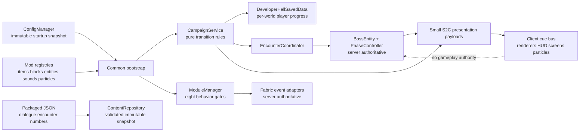

# Architecture Patterns

**Domain:** Single-JAR Minecraft Java 26.2 Fabric comedy campaign and anthology mod
**Project:** Developer's Hell
**Researched:** 2026-08-25
**Confidence:** MEDIUM — recommendations are grounded in current official Fabric 26.2 documentation, but exact mapped method names should still be compiled against the generated template before implementation.

## Recommended Architecture

Build one small, coherent monolith with vertical feature packages and a narrow shared kernel. Do not create eight Gradle subprojects, a generic scripting engine, or an event-bus framework. All content is registered in one JAR; configuration gates behavior, while a server-owned campaign service coordinates progression and reusable boss machinery.



The design has three deliberately different kinds of state:

1. **Configuration** is machine-local, loaded once before module hooks are installed, and never saved into a world.
2. **Gameplay state** is server-owned and persisted with the world. This includes campaign progress and idempotence markers.
3. **Presentation state** is ephemeral client state derived from synchronized entity fields or server-to-client cues. It may be lost and reconstructed without changing gameplay.

This separation is important even for singleplayer because an integrated singleplayer game still has a logical server. Fabric's 26.2 networking documentation explicitly treats packets as the client/server bridge in singleplayer as well as multiplayer.

## Component Boundaries

| Component | Responsibility | Communicates With |
|-----------|----------------|-------------------|
| `DeveloperHell` common entrypoint | Load and validate config; invoke registration in a fixed order; install server hooks | Registry classes, payload types, content loader, campaign, modules |
| `DeveloperHellClient` client entrypoint | Register entity renderers, model layers, HUD, particles, screens, keybinds, and client payload receivers | Client cue bus and presentation payloads only |
| `ModIds` and `registry/*` | Own every namespaced identifier and all unconditional game registrations | Bootstrap, bosses, modules; no campaign decisions |
| `ConfigManager` | Read one local config file, merge defaults, validate ranges and public-safe strings, expose an immutable snapshot | Bootstrap and `ModuleGate` |
| `ModuleCatalog` / `ModuleGate` | List exactly eight modules and answer whether a behavior is enabled | Event adapters, custom items, campaign initiation |
| `CampaignReducer` | Pure, deterministic `state + event -> state/effects` transition logic | Unit tests and `CampaignService`; no Minecraft classes |
| `CampaignService` | Load progress, validate transitions, mark persistence dirty, issue rewards once, start encounters | Saved data, encounter coordinator, dialogue, networking |
| `DeveloperHellSavedData` | Persist schema version, per-player progress, encounter references, timers, and one-shot reward markers | Campaign service; no rendering or event registration |
| `EncounterCoordinator` | Enforce at most one campaign encounter per owner, spawn/reacquire bosses, recover missing encounters after reload | Campaign service and boss entities |
| `BaseDeveloperBossEntity` | Vanilla entity lifecycle, boss bar, save/load, phase sync, owner/encounter identity | Phase controller, attack scheduler, encounter coordinator |
| `PhaseController` / `AttackScheduler` | Deterministic server-tick phase transitions, telegraphs, impacts, cooldowns | Boss definition, attack library, cue sender |
| `AttackLibrary` | Whitelisted reusable attack primitives such as volley, area pulse, beam, dash, summons, hazard field, and debuff | Boss scheduler; never loaded by arbitrary class name from JSON |
| `ContentRepository` | Parse and validate dialogue/encounter JSON with Codecs; atomically publish a last-known-good snapshot | Dialogue service, boss definitions, module joke pools |
| `DialogueService` | Resolve a dialogue key against context and deterministic RNG; return translatable or literal components | Campaign, bosses, terminal, modules |
| `HellEventAdapters` | Translate a small set of Fabric callbacks into campaign/module calls | Module manager and campaign service |
| `network/*` | Declare payload records/codecs, register payload types on both sides, send bounded presentation snapshots/cues | Common bootstrap, client bootstrap |
| `client/*` | Render only: entities, emissive layers, boss telegraphs, HUD, terminal screen, sounds and particles | Synced entity fields and received payloads |
| `gametest/*` | Verify transitions and actual server-world mechanics in isolated fixtures | Public service APIs and debug/test factories |

## Package and Resource Layout

Use one Java package namespace and the normal Fabric split source sets. The illustrative package below avoids tying the project to a real person or company name.

```text
src/main/java/dev/developershell/
  DeveloperHell.java
  ModIds.java
  config/
    DeveloperHellConfig.java
    ConfigManager.java
  registry/
    ModItems.java
    ModBlocks.java
    ModEntities.java
    ModSounds.java
    ModParticles.java
    ModDataComponents.java
  campaign/
    CampaignChapter.java
    CampaignEvent.java
    CampaignProgress.java
    CampaignReducer.java
    CampaignService.java
    DeveloperHellSavedData.java
    EncounterCoordinator.java
  boss/
    BaseDeveloperBossEntity.java
    BossDefinition.java
    PhaseController.java
    AttackScheduler.java
    AttackPattern.java
    AttackLibrary.java
    lecture/
    jury/
    chairman/
    overdraft/
  module/
    HellModule.java
    ModuleCatalog.java
    ModuleGate.java
    graduation/
    metadata/
    python/
    codexterminal/
    git/
    stackoverflow/
    rubberduck/
    deadline/
  content/
    ContentRepository.java
    DialogueService.java
    EncounterDefinition.java
  network/
    ModPayloads.java
    CampaignSnapshotPayload.java
    PresentationCuePayload.java
    TerminalActionPayload.java
  server/
    HellEventAdapters.java
    DeveloperHellCommands.java

src/client/java/dev/developershell/client/
  DeveloperHellClient.java
  ClientCueBus.java
  hud/
  render/
  screen/

src/main/resources/
  fabric.mod.json
  assets/developers_hell/
    lang/en_us.json
    textures/{entity,item,block,gui,particle}/
    models/{item,block}/
    sounds.json
    sounds/
  data/developers_hell/
    dialogue/
    encounters/
    modules/<module-id>/
    recipes/
    loot_tables/
    advancements/

src/test/java/dev/developershell/
src/gametest/java/dev/developershell/
src/gametest/resources/fabric.mod.json
```

Keep `client/*` physically under `src/client/java` and never import a `net.minecraft.client.*` type from common code. Fabric's project-structure guidance recommends separate common and client entrypoints specifically to prevent dedicated-server class-loading failures.

## Registration and Bootstrap Seams

Registration is unconditional and centralized. A disabled module must not remove an item, entity, block, sound, or data component from registries: removing registered IDs based on a local config can make existing worlds fail to load or lose content.

Use this order in the common initializer:

1. Load and validate `DeveloperHellConfig`.
2. Register all identifiers and content types (`ModItems`, `ModBlocks`, `ModEntities`, sounds, particles, data components).
3. Register custom payload types and codecs on the common side.
4. Register the server-data reload listener and its Codecs.
5. Install campaign/server lifecycle hooks.
6. Build `ModuleCatalog`; install only behavior hooks allowed by the startup config.
7. Register commands and test/debug seams.

The 26.2 update changes registration and rendering APIs. Put mapped calls in `registry/*`, `network/ModPayloads`, the resource-loader adapter, and `client/*` instead of scattering them through boss logic. Follow the current Fabric example/template pattern that separates block IDs, block-item IDs, and item IDs. Avoid deprecated `ResourceManagerHelper` reload APIs; current 26.2 Javadocs direct mods to `ResourceLoader.registerReloadListener` or `DataResourceLoader`.

## Campaign State Machine

Model progression as an explicit monotonic state machine rather than checking ad hoc booleans throughout items and boss classes.

```text
UNSIGNED
  --SIGN_CONTRACT--> INTERNSHIP
  --LECTURE_STARTED--> LECTURE
  --LECTURE_DEFEATED--> JURY
  --JURY_CLEARED--> CHAIRMAN
  --CHAIRMAN_DEFEATED--> SPONSORED
  --TOKEN_DEPLETED--> OVERDRAFT
  --OVERDRAFT_DEFEATED--> GRADUATED
```

`CampaignProgress` should be a small immutable record containing:

- `schemaVersion`
- current `CampaignChapter`
- completed milestone IDs
- optional active `EncounterRef` (`entity UUID`, dimension key, arena origin, encounter seed)
- sponsor token counter and deadline tick, if active
- one-shot reward IDs already granted

`DeveloperHellSavedData` stores a map keyed by player UUID. That costs little in singleplayer while avoiding hard-coding a single global player if the world is later opened to LAN. Store it in the server overworld's data storage so progress is cross-dimensional. Use a Codec and mark the saved data dirty only after a successful transition.

All entry points call `CampaignService.handle(player, event)`. The service asks the pure `CampaignReducer` for a transition, rejects out-of-order events, persists the new state, and then executes declared effects. Effects such as `START_ENCOUNTER`, `GRANT_REWARD`, `PLAY_DIALOGUE`, and `SYNC_PROGRESS` must be idempotent. Repeating a boss-death callback cannot grant a second diploma because the milestone/reward marker is already present.

For recovery, `EncounterCoordinator` should reacquire the saved boss UUID after world load. If the chapter expects an encounter but the entity is missing, allow a controlled respawn at the saved arena origin rather than silently deadlocking graduation. Do not attempt a custom campus dimension in v1.

## Boss Framework

Use one concrete entity type per major visual boss, all sharing a thin `BaseDeveloperBossEntity`. Composition should carry the encounter logic: the base entity delegates to a `PhaseController` and `AttackScheduler`, while each boss contributes a `BossDefinition` and a small Java attack pool.

### State ownership

- The logical server selects attacks, moves entities, spawns hazards/adds, applies damage/effects, changes phases, grants rewards, and advances the campaign.
- The entity saves boss ID, owner UUID, encounter seed, current phase, and any long-lived encounter counters. Vanilla already persists health and position.
- `SynchedEntityData` carries only compact presentation-relevant fields: phase index, active telegraph ID, cast start/end tick, and enraged flag.
- On reload, cancel an in-flight cast and resume from an idle cooldown. Never let a stale telegraph land immediately on a rejoining player.
- A vanilla `ServerBossEvent` owns the boss bar. The Jury Gauntlet can be a leader/coordinator boss with summoned jury members and one shared bar instead of inventing a second encounter engine.

### Phase and attack contract

```java
public interface AttackPattern {
    Identifier id();
    boolean canStart(BossContext context);
    Telegraph start(BossContext context, RandomSource random);
    void impact(BossContext context, Telegraph telegraph);
}
```

`BossDefinition` data selects whitelisted attack IDs and supplies tunable values such as phase thresholds, cooldown ranges, dialogue keys, weights, and telegraph duration. Java implements mechanics. This is intentionally less ambitious than a fully data-driven combat scripting language: JSON is excellent for jokes and tuning, while arbitrary command graphs would consume the entire sprint and be harder to validate.

Provide seven reusable primitives first: projectile volley, radial pulse, line/beam, dash, targeted falling hazard, summon adds, and debuff zone. Boss identity then comes from combinations and presentation:

- **Professor Infinite Slides:** slide-wall beam, attendance lock-on, pop-quiz projectiles.
- **Jury Gauntlet:** wave summons, interrupting questions, shared-pressure meter.
- **Chairman:** rubric shield, rejection cone, revision adds, final enraged phase.
- **Codex Overdraft:** radiant sponsor cues become corrupted token storms, fake agent clones, hallucination zones, and an overdraft beam.

Use a saved encounter seed and injected `RandomSource` so attack selection can be deterministic in tests. Limit boss spawning through the coordinator; development commands may bypass this only at permission level 2.

## Module Interface and Toggles

Use exactly one `ModuleCatalog` containing eight `HellModule` implementations. Keep the interface small:

```java
public interface HellModule {
    Identifier id();
    void registerContent(RegistrationContext context); // always called
    ModuleHooks hooks();                                // installed only when enabled
}
```

The config contains the eight stable module IDs. `graduation_anyfail` gates normal contract initiation and school ambient events; boss/entity registrations still exist so saved worlds and admin testing remain valid. Items belonging to a disabled module should return a clear "module disabled" action result or become inert, not crash and not disappear from registries.

Do not create a universal reflection-driven hook system. Centralize only genuinely shared callbacks such as server tick, entity death, player join, and item use in `HellEventAdapters`, then dispatch to enabled `ModuleHooks`. Custom items, entities, and block entities may call their module service directly after consulting `ModuleGate`.

| Module | Architectural home | Special rule |
|--------|--------------------|--------------|
| Graduation% AnyFAIL | Campaign service and school event hooks | The campaign remains the primary vertical slice and defaults on |
| Metadata Roulette | `TraitService`, `TraitAdapter` whitelist, timed trait leases | Never copy raw tracked-data entries or private entity internals |
| Python Tools | Custom items/components and recipes | Behavior stays local to item classes; jokes come from dialogue data |
| Codex Rich Kid Terminal | Block + block entity + validated screen payloads | Terminal never performs network/API calls; token activity is simulated |
| Git Happens | Item actions and bounded server events | World-changing actions require server checks and cooldowns |
| Stack Overflow Totem | Totem item and deterministic outcome table | Resolve outcomes on server; show result through cues |
| Rubber Duck Engineering | Item interaction and nearby-problem query service | Cap scan radius and work per activation; never scan the whole world |
| Three-Day Deadline | Per-player deadline record and coarse server-tick scheduler | Process on a cadence (for example every 20 ticks), not every module every tick |

For Metadata Roulette, represent chaos as compatible, reversible traits. Each `TraitAdapter` declares supported entity predicates, applies namespaced attribute modifiers/effects/goal changes, and returns an `AppliedTraitLease` that knows how to remove itself. Never snapshot and transplant arbitrary metadata. Prefer transient attribute modifiers and explicit behavior controllers so restore is reliable after timeout or entity unload.

## Configuration

Expose one file in Fabric Loader's config directory, for example `config/developers_hell.json`. Its public-safe defaults include fictional school/company names and the configurable sponsor math joke. Parse into an immutable `DeveloperHellConfig`, validate enum/module IDs, clamp numeric ranges, and log one actionable error per invalid field.

Configuration should be startup-only in v1. Hot-reloading module hooks requires unregister semantics Fabric events do not generally provide and creates confusing half-enabled encounters. `/devhell status` can print effective values and state that a restart is required after edits. `/reload` may reload datapack dialogue/encounter content independently.

Do not bundle a locally customized config into the JAR or commit it. Packaged defaults live in code or a public-safe default resource; personal/employer strings stay in the user's runtime config.

## Data-Driven Content and Assets

Use Mojang Codecs to parse packaged JSON under `data/developers_hell/`. Current Fabric documentation recommends Codecs for custom JSON and highlights partial-error handling for datapack resources.

`ContentRepository` should load three bounded schemas:

- dialogue pools: key, speaker role, lines, weight, optional chapter/module filters
- encounter tuning: boss ID, phase thresholds, whitelisted attack IDs, weights, cooldowns, cue/dialogue keys
- module outcome tables: safe outcome ID, weight, bounds, dialogue key

The reload listener prepares a complete candidate snapshot, validates identifiers/ranges/references, and atomically swaps it on the server apply phase only if core entries are valid. Malformed optional entries are logged and skipped. Keep a minimal built-in fallback for required boss definitions so a bad resource pack cannot permanently deadlock a world.

Keep assets conventional and offline under `assets/developers_hell`: original pixel textures, language strings, models, `sounds.json`, and license-compatible audio. Prefer vanilla renderer APIs, model layers, emissive passes, particles, and HUD elements. The official 26.2 Fabric notes warn that rendering backends are changing; do not issue raw OpenGL calls or write a custom shader pipeline for the glowing Rich ChatGPT look.

## Networking and Client Rendering

Register payload types/codecs in the common initializer on both physical sides; register client receivers only in `DeveloperHellClient`. Keep the packet surface intentionally tiny:

| Payload | Direction | Contents | Validation |
|---------|-----------|----------|------------|
| `CampaignSnapshotPayload` | S2C | Current chapter, sponsor tokens, active encounter ID | Sent on join/transition; client only displays it |
| `PresentationCuePayload` | S2C | Cue ID, source entity/position, seed, start tick, duration | Cue ID must be in a client whitelist; no arbitrary resource/class names |
| `TerminalActionPayload` | C2S | Block position and bounded action enum | Server verifies loaded chunk, distance, terminal block/entity, module enabled, campaign state, and cooldown |

Never send a packet each boss tick. Send a telegraph once with server time and duration, synchronize compact entity fields, and let the client animate locally. Damage still occurs on the server impact tick. Send cues only to players tracking the entity/chunk where practical.

`ClientCueBus` holds short-lived visual/audio cues keyed by source entity UUID or block position. Losing these cues on disconnect is acceptable. On reconnect the campaign snapshot and synced entity data reconstruct essential UI; presentation cannot advance a phase or deal damage.

## Data Flow

### Starting and advancing the campaign

```text
Player uses Cursed Contract
  -> server item handler checks graduation_anyfail toggle
  -> CampaignService.handle(SIGN_CONTRACT)
  -> CampaignReducer validates current chapter
  -> DeveloperHellSavedData updates + marks dirty
  -> EncounterCoordinator creates lecture encounter
  -> S2C snapshot/dialogue cue
  -> client renders HUD and narration
```

### Boss attack

```text
Server boss tick
  -> AttackScheduler selects a legal attack using encounter RNG
  -> server records telegraph state + sends one cue
  -> clients render warning from synchronized time
  -> server impact executes authoritative damage/hazards
  -> clients receive ordinary entity/world sync plus optional impact cue
```

### Resource reload

```text
/reload
  -> resource loader parses candidate JSON with Codecs
  -> validate attack IDs, dialogue references, ranges, duplicate IDs
  -> atomically publish immutable ContentSnapshot
  -> active encounters retain their current Java state and use new tuning next selection
```

## Patterns to Follow

### Pure reducer plus imperative effects

**What:** Keep progression rules free of Minecraft types, then execute a small list of effects through the server service.

**When:** Every contract, boss death, token depletion, and diploma transition.

**Why:** It makes the campaign exhaustively testable without booting a world and prevents reward/transition logic from being duplicated across entities.

### Server-authoritative mechanics, client-authored spectacle

**What:** Server chooses and resolves mechanics; client turns bounded cues into rich visuals.

**When:** Boss attacks, terminal actions, module outcomes, and HUD updates.

**Why:** It prevents singleplayer desync today and leaves LAN/dedicated-server behavior sane later.

### Register always, gate behavior

**What:** Keep registry identity stable across configs and versions; toggle only runtime behavior.

**When:** All eight modules.

**Why:** A save can safely move between installations with different local toggle values.

### Atomic last-known-good content snapshot

**What:** Parse/validate into a new immutable object and swap only after success.

**When:** Initial data load and `/reload`.

**Why:** A malformed joke pack cannot leave half the dialogue/encounter registry replaced.

## Anti-Patterns to Avoid

### Conditional registry identity

**What:** Registering an entity/item only when its module is enabled.

**Why bad:** Changing a local config can orphan IDs already present in a world.

**Instead:** Register all content and gate recipes/actions/spawning.

### Client-authoritative boss actions

**What:** Letting a screen, keybind, renderer, or client packet decide damage, rewards, or phase changes.

**Why bad:** Integrated-server desync, duplication exploits, and dedicated-server failure.

**Instead:** Treat client input as a request and validate/recompute on the server.

### Per-tick packet animation

**What:** Streaming particle positions or boss progress every tick.

**Why bad:** Needless network and allocation cost; animation breaks under lag.

**Instead:** Send cue ID, seed, server start tick, origin, and duration once.

### Fully scripted combat DSL

**What:** Encoding arbitrary boss behavior graphs or Java class names in JSON.

**Why bad:** Too large and unsafe for a 1–2 day build, hard to validate, and difficult to debug.

**Instead:** Java attack primitives plus data-driven weights, numbers, dialogue, and sequencing.

### Raw metadata shuffle

**What:** Copying `SynchedEntityData`/tracked-data slots between unrelated entity types.

**Why bad:** Schemas and serializers are type-specific; corruption and crashes are predictable.

**Instead:** Whitelisted reversible trait adapters with compatibility predicates.

### Static mutable world progress

**What:** Storing chapter/tokens in static fields.

**Why bad:** State disappears on restart, leaks between worlds in one process, and cannot recover encounters.

**Instead:** Codec-backed world `SavedData` accessed through `CampaignService`.

### Broad mixin dependence

**What:** Injecting into core entity/tick/render methods for every joke.

**Why bad:** Minecraft 26.2 API/mapping churn makes each injection a maintenance and compatibility risk.

**Instead:** Prefer Fabric events, entity/item subclasses, vanilla goals, attributes, and public APIs. Add a narrowly tested mixin only where no event or subclass seam exists.

## Testing Strategy

Use three layers, weighted toward fast deterministic tests:

1. **Fabric Loader JUnit:** campaign transition table, invalid transition rejection, one-shot effects, config validation, Codecs and schema defaults, attack scheduler determinism, module gate behavior, trait compatibility and lease restoration.
2. **Server GameTests:** contract starts the campaign; lecture health threshold changes phase; boss death advances exactly once; reload recovery can respawn a missing expected encounter; disabled module handlers are no-ops; Metadata Roulette never applies an incompatible trait.
3. **Client smoke/manual checks:** launch a test world, render each boss/telegraph, open the terminal, verify HUD at common GUI scales, and verify no client classes load under a dedicated-server run. Add one client GameTest screenshot flow only if it is stable in the generated toolchain; the current client GameTest API is documented but still marked experimental.

Fabric's current guide recommends a separate `gametest` source set through Loom. Server GameTests run as part of `build`; client GameTests have a separate task. Keep fixture commands such as `/devhell stage`, `/devhell spawn_boss`, `/devhell reset`, and `/devhell modules` permission-gated so humans can reproduce failures quickly.

## Runtime Scope and Performance

| Concern | Singleplayer v1 | LAN / small server | Larger modpack server |
|---------|-----------------|--------------------|-----------------------|
| Campaign state | One UUID entry in world SavedData | Independent player entries; one active encounter per owner | Add encounter caps and party semantics only if demanded |
| Boss ticking | One active encounter, normal entity tick | Limit concurrent owners near the same arena | Profile hazards/adds; cap entities and dormant encounters |
| Module ticking | One coarse dispatcher cadence | Dispatch only enabled modules and online players | Budget work per tick; avoid global entity/chunk scans |
| Networking | A few event-driven cues | Send to tracking players | Preserve tracking filters and payload bounds |
| Data reload | Small immutable JSON snapshot | Same | Validate maximum entry/line counts if accepting large third-party packs |

The architecture is not designed for thousands of concurrent users; Minecraft server scale is the relevant boundary. Avoid work proportional to all loaded entities every tick. Rubber Duck scans and Metadata Roulette selection must use bounded radius/count limits.

## Suggested Build Order

1. **Toolchain and side-safe shell**
   - Generate the official 26.2 Fabric project, pin current recommended versions, create common/client entrypoints, registries, payload registration, and a dedicated-server launch smoke test.
   - This retires the highest version-churn risk before feature code exists.

2. **State/config/content kernel**
   - Implement immutable config, module IDs/gates, campaign records/reducer, SavedData Codec, content schemas/reloader, and unit tests.
   - No custom boss art is required yet; use debug commands and placeholders.

3. **One complete vertical slice**
   - Cursed Contract -> Lecture boss -> phase telegraph -> defeat transition -> unique reward.
   - Build `BaseDeveloperBossEntity`, attack primitives, boss bar, one S2C cue, renderer, persistence recovery, and server GameTests here. Treat this as the architecture proof.

4. **Complete the boss campaign**
   - Add Jury, Chairman, radiant sponsor interlude, token depletion, Codex Overdraft transformation, final reward, and graduation state using the proven framework.
   - Keep each boss mechanically distinct by composing existing primitives before adding a new primitive.

5. **Eight anthology modules in risk order**
   - First: Python Tools, Git Happens, Stack Overflow Totem, Rubber Duck, Three-Day Deadline.
   - Then: Codex Terminal and campaign integration.
   - Last: Metadata Roulette, because compatibility/restoration deserves focused tests. Graduation% AnyFAIL is already delivered by the vertical campaign.

6. **Offline content, assets, hardening, and release**
   - Fill dialogue/outcome JSON, integrate generated original pixel assets, add sounds/credits/licenses, run datagen if enabled, build the JAR, run server tests and client/dedicated-server smoke tests, and verify a clean offline install.

The stopping rule for scope pressure is: preserve a complete contract-to-diploma campaign and all eight toggles, but reduce the number of outcomes/items per optional module before cutting boss readability, persistence, or release verification.

## Phase-Specific Research Flags

| Phase topic | Research need | Reason |
|-------------|---------------|--------|
| 26.2 scaffold/registration | Recheck immediately before coding | Exact Fabric API/Loader/Loom versions and mapped names are drift-prone |
| Rendering the radiant/emissive sponsor | Short targeted spike | 26.2 rendering/backend changes make copied older OpenGL tutorials unsafe |
| Boss framework | Standard implementation after vertical slice | Vanilla entity, synced data, boss event, and server tick patterns are established |
| Metadata Roulette aggression/AI traits | Deeper phase research | Goal selector modification and reversible cross-entity behavior are the riskiest module seam |
| Saved campaign state | Standard pattern with GameTests | Saved Data + Codec is documented for 26.2 |
| Client GameTests in CI | Optional validation | Current docs note experimental client tests and a possible network synchronizer issue |

## Sources

All technical sources below are official Fabric documentation or official Fabric-hosted API Javadocs, checked 2026-08-25. Provider-derived confidence is MEDIUM because Context7 was unavailable and the research seam fell back to web search.

- [Fabric 26.2 project structure and sided entrypoints](https://docs.fabricmc.net/develop/getting-started/project-structure)
- [Fabric 26.2 networking and logical-side guidance](https://docs.fabricmc.net/develop/networking)
- [Fabric 26.2 Saved Data](https://docs.fabricmc.net/develop/serialization/saved-data)
- [Fabric 26.2 Data Attachments](https://docs.fabricmc.net/develop/serialization/data-attachments)
- [Fabric 26.2 Codecs](https://docs.fabricmc.net/develop/serialization/codecs)
- [Fabric 26.2 entity server/client responsibilities](https://docs.fabricmc.net/develop/entities/first-entity)
- [Fabric 26.2 automated testing](https://docs.fabricmc.net/develop/automatic-testing)
- [Fabric 26.2 porting guide](https://docs.fabricmc.net/develop/porting/)
- [Official Fabric 26.2 update notes](https://www.fabricmc.net/2026/06/15/262.html)
- [Fabric API 26.2 deprecated resource APIs](https://maven.fabricmc.net/docs/fabric-api-0.152.0%2B26.2/deprecated-list.html)

